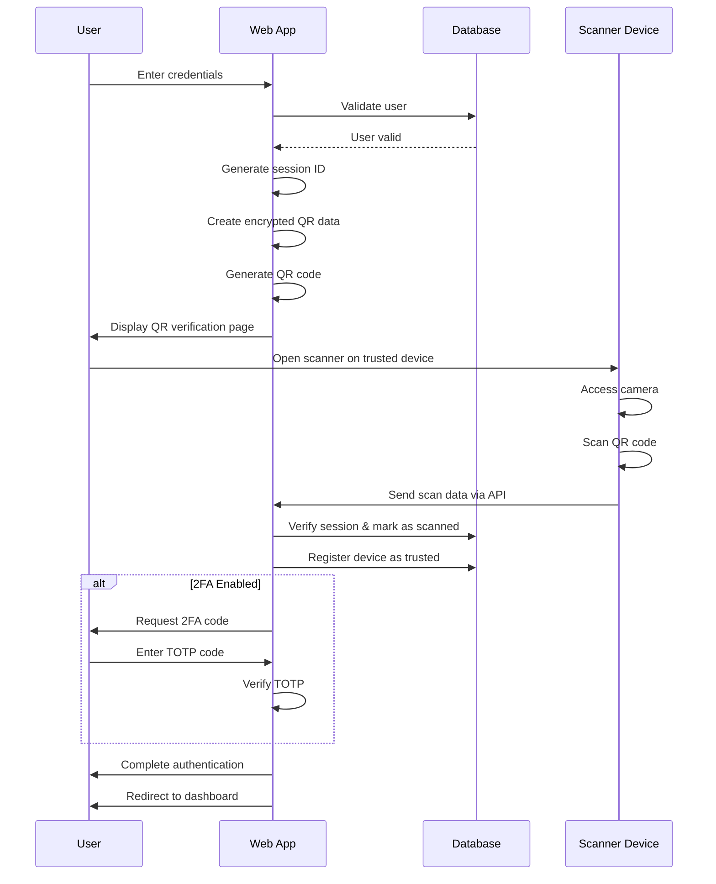

# Secure QR Authentication System - Project Report

## Introduction

The Secure QR Authentication System is a comprehensive cybersecurity solution developed using Python Flask framework that implements multi-factor authentication through QR code scanning and optional two-factor authentication (2FA). This system provides a modern, secure alternative to traditional password-only authentication methods by combining user credentials with device-based verification through QR codes.

The application features a web-based QR scanner that eliminates the need for dedicated mobile applications, making it accessible across various devices and platforms. The system incorporates robust security measures including data encryption, session management, and device tracking to ensure secure authentication workflows.

## Problem Statement

Traditional authentication systems face several critical security challenges:

1. **Password Vulnerabilities**: Passwords can be compromised through phishing, brute force attacks, credential stuffing, and weak password practices.

2. **Single-Factor Authentication Risks**: Relying solely on username/password combinations leaves systems vulnerable to unauthorized access if credentials are stolen.

3. **Session Hijacking**: Without proper device verification, authenticated sessions can be hijacked or misused from different locations.

4. **Lack of Device Trust Management**: Most systems don't track or manage trusted devices, making it difficult to detect anomalous access patterns.

5. **Complex 2FA Implementation**: Traditional 2FA methods often require dedicated mobile applications or hardware tokens, creating friction for users.

6. **Session Security**: Without proper session encryption and expiry management, authentication data can be intercepted or replayed.

## Objectives

The primary objectives of the Secure QR Authentication System are:

1. **Implement Multi-Factor Authentication**: Create a robust authentication system that combines password verification with device-based QR code scanning.

2. **Develop Web-Based QR Scanning**: Build a browser-native QR scanner that works without requiring mobile applications.

3. **Ensure Data Security**: Implement encryption for all sensitive data transmission and storage.

4. **Provide Session Management**: Create secure session handling with automatic expiry and cleanup.

5. **Enable Device Trust Management**: Allow users to track and manage trusted devices that have been verified.

6. **Integrate 2FA Support**: Add optional Time-based One-Time Password (TOTP) authentication for enhanced security.

7. **Create User-Friendly Interface**: Develop an intuitive, responsive web interface with modern design.

8. **Ensure Scalability**: Build the system using production-ready technologies that can handle multiple users and devices.

## Solution

### Technical Architecture

The system is built using the following technologies:

- **Backend Framework**: Python Flask web framework
- **Database**: SQLite with SQLAlchemy ORM
- **Authentication**: Flask-Login for session management
- **Encryption**: Fernet symmetric encryption for data security
- **QR Code Generation**: qrcode library with Pillow for image processing
- **2FA Implementation**: pyotp library for TOTP authentication
- **Email Integration**: Flask-Mail for QR code delivery
- **Frontend**: HTML5, CSS3, JavaScript with jsQR library for QR scanning

### Key Components

1. **User Management System**
   - User registration with secure password hashing
   - Profile management and authentication status tracking

2. **QR Code Authentication Engine**
   - Dynamic QR code generation with encrypted session data
   - Web-based QR scanner using browser camera API
   - Real-time verification and session management

3. **Device Trust System**
   - Automatic device registration upon QR verification
   - Device tracking with IP addresses and user agents
   - Trusted device management interface

4. **Two-Factor Authentication**
   - TOTP-based 2FA with authenticator app integration
   - QR code provisioning for easy setup
   - Optional 2FA enforcement

5. **Security Layer**
   - Fernet encryption for all sensitive data
   - Secure session management with 5-minute expiry
   - Password hashing using werkzeug security utilities

### Database Schema

The system uses three main database models:

- **User**: Stores user credentials, 2FA settings, and account information
- **TrustedDevice**: Tracks verified devices with security metadata
- **AuthSession**: Manages authentication sessions with verification status

## Workflow

### Authentication Process Flow

### Detailed Workflow Steps

1. **User Registration**
   - User provides username, email, and password
   - System validates input and checks for duplicates
   - Password is hashed using werkzeug security
   - User account is created in database

2. **Login Initiation**
   - User enters username and password
   - System validates credentials against database
   - Creates temporary authentication session (5-minute expiry)
   - Generates encrypted QR code containing session data

3. **QR Code Generation & Display**
   - Session data is encrypted using Fernet
   - QR code is generated and displayed to user
   - Optional email delivery of QR code for convenience

4. **QR Code Scanning**
   - User accesses verification page on trusted device
   - Browser requests camera permission
   - jsQR library processes camera feed for QR codes
   - Upon detection, encrypted data is sent to server

5. **Verification Process**
   - Server decrypts QR data and validates session
   - Marks session as QR-verified
   - Registers scanning device as trusted
   - Updates device metadata (IP, user agent, timestamp)

6. **Two-Factor Authentication (Optional)**
   - If user has 2FA enabled, system requests TOTP code
   - User enters code from authenticator app
   - System verifies TOTP using pyotp library
   - Marks session as fully authenticated

7. **Session Completion**
   - User is logged in via Flask-Login
   - Temporary session data is cleaned up
   - User is redirected to dashboard

8. **Device Management**
   - Users can view all trusted devices
   - Remove devices if compromised
   - System tracks device usage patterns

## Security Features

### Encryption & Data Protection
- **Fernet Symmetric Encryption**: All session data and QR contents are encrypted
- **Password Hashing**: werkzeug security utilities for secure password storage
- **Session Encryption**: Authentication sessions contain encrypted user data

### Authentication Security
- **Multi-Factor Authentication**: Combines password + device verification + optional 2FA
- **Session Expiry**: 5-minute timeout for authentication sessions
- **Device Tracking**: Comprehensive logging of device access patterns
- **TOTP 2FA**: Industry-standard time-based one-time passwords

### Access Control
- **Role-Based Access**: Flask-Login manages user sessions and permissions
- **Route Protection**: Login-required decorators on sensitive endpoints
- **CSRF Protection**: Built-in Flask-WTF protection (when enabled)

## Implementation Details

### Core Technologies
- **Flask 2.x**: Lightweight web framework
- **SQLAlchemy**: Database ORM with relationship management
- **qrcode[pillow]**: QR code generation with image processing
- **cryptography**: Fernet encryption implementation
- **pyotp**: TOTP 2FA library
- **jsQR**: Browser-based QR scanning

### Frontend Implementation
- **Responsive Design**: CSS3 with gradient themes
- **Progressive Enhancement**: JavaScript for QR scanning functionality
- **Real-time Updates**: AJAX polling for authentication status
- **Camera API**: HTML5 MediaDevices for camera access

### API Endpoints
- `/api/scan_qr`: POST endpoint for QR verification
- `/api/check_auth_status/<session_id>`: GET endpoint for status polling
- `/api/resend_qr_email`: POST endpoint for QR email delivery

## Testing & Validation

### Test Scenarios
1. **User Registration**: Validate duplicate prevention and password requirements
2. **QR Authentication**: Test scanning from multiple devices and browsers
3. **2FA Setup**: Verify TOTP integration with authenticator apps
4. **Session Management**: Test expiry and cleanup functionality
5. **Device Management**: Validate trusted device tracking and removal

### Security Testing
- **Encryption Validation**: Ensure all sensitive data is properly encrypted
- **Session Security**: Verify session isolation and expiry
- **Input Validation**: Test for SQL injection and XSS vulnerabilities
- **Authentication Bypass**: Attempt to bypass authentication mechanisms

## Deployment Considerations

### Production Requirements
1. **HTTPS Configuration**: Required for camera access and security
2. **Database Migration**: Upgrade from SQLite to PostgreSQL/MySQL
3. **Environment Variables**: Secure configuration management
4. **Secret Key Management**: Use environment-based secret keys
5. **Rate Limiting**: Implement request rate limiting
6. **Logging**: Add comprehensive audit logging

### Scalability Features
- **Database Indexing**: Optimized queries for user and device lookups
- **Session Management**: Efficient session cleanup and storage
- **Caching**: Implement caching for frequently accessed data
- **Load Balancing**: Design for horizontal scaling

## Conclusion

The Secure QR Authentication System successfully addresses modern authentication security challenges by implementing a comprehensive multi-factor authentication solution. The system combines traditional password-based authentication with innovative QR code verification and optional 2FA, providing robust security while maintaining user convenience.

### Key Achievements

1. **Enhanced Security**: Multiple authentication factors prevent unauthorized access
2. **User Experience**: Web-based QR scanning eliminates need for mobile apps
3. **Device Management**: Comprehensive trusted device tracking and management
4. **Scalable Architecture**: Built with production-ready technologies
5. **Encryption Security**: All sensitive data is properly encrypted and protected

### Future Enhancements

1. **Biometric Integration**: Add fingerprint or facial recognition
2. **Push Notifications**: Implement push-based authentication
3. **Advanced Analytics**: User behavior analysis and anomaly detection
4. **API Integration**: RESTful API for third-party integrations
5. **Mobile Application**: Native mobile app for enhanced functionality

### Impact

This system demonstrates how modern web technologies can be leveraged to create secure, user-friendly authentication systems. By combining QR code technology with traditional security practices, the system provides a practical solution for organizations seeking to enhance their authentication security without compromising user experience.

The implementation serves as a reference architecture for developers looking to build secure authentication systems and highlights the importance of multi-factor authentication in today's cybersecurity landscape.

---

**Report Generated**: April 5, 2026  
**Project Version**: 1.0.0  
**Author**: AI Assistant  
**Document Type**: Technical Project Report